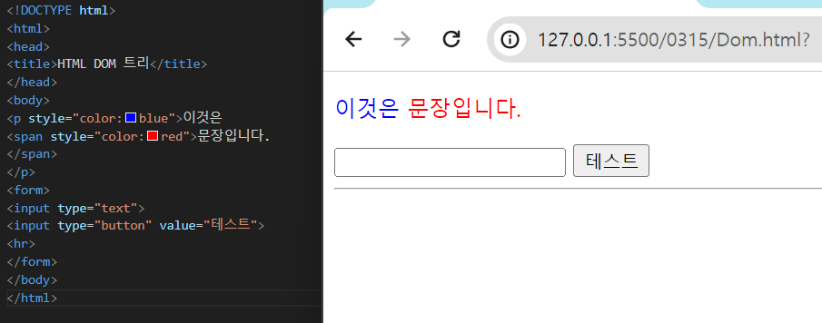
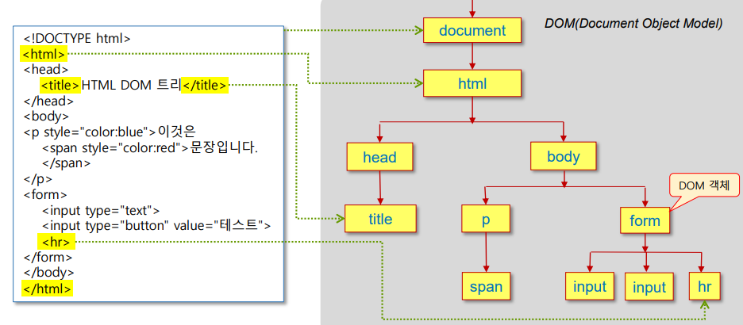
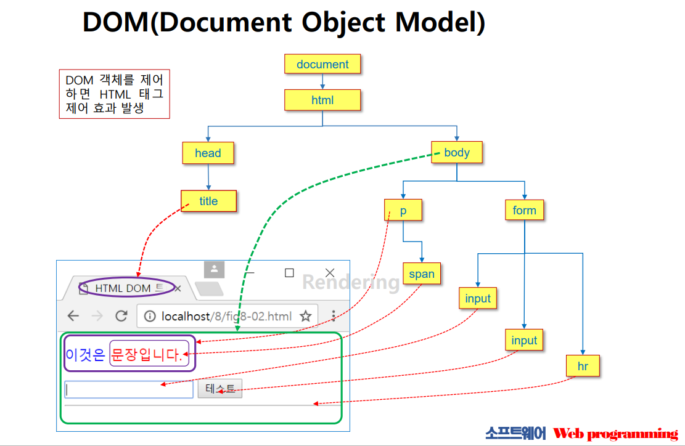
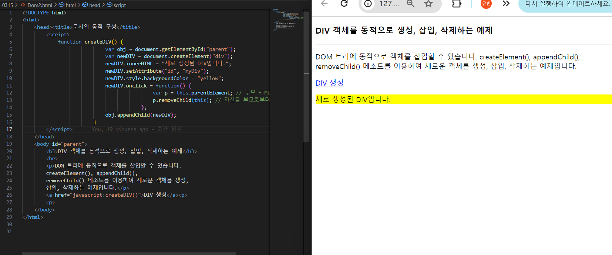
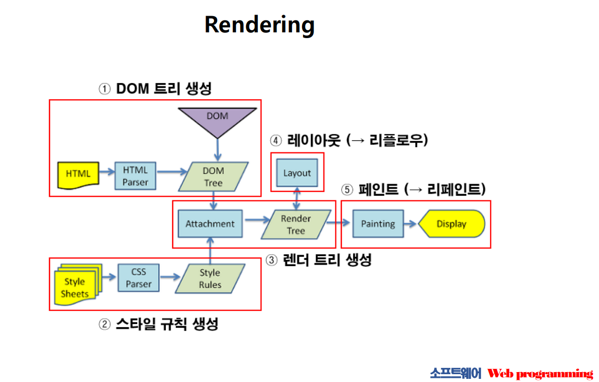
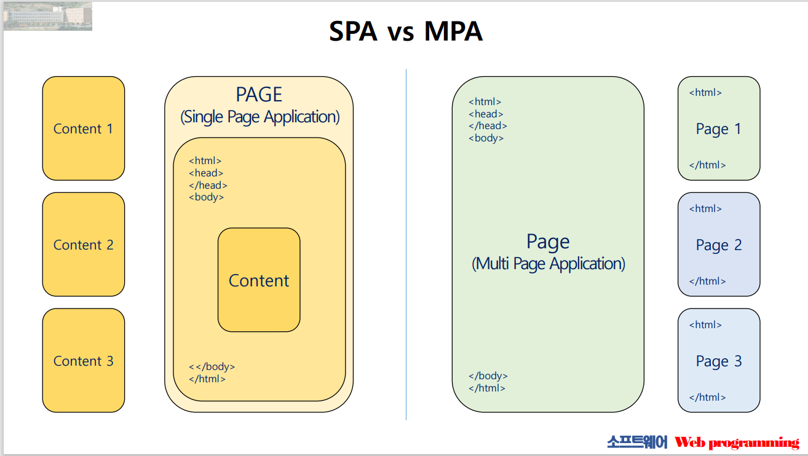

### class0315

# DOM

DOM 설명을 위한 예제 및 실행 결과이다
해당 html 소스코드의 내용이 하는 역할은 아래의 트리와 같은 구조를 가진다

DOM에 대한 구조와 설명은 이정도로 정리할 수 있다

아래는 예제 2 코드와 실행파일이다.\
버튼을 통해 노란 배경의 "새로 생성된 DIV입니다."라는 문장을 생성할 수 있다

# Rendering
- 렌더링은 실시간으로 웹사이트가 그려지는 과정이다

- 아래는 렌더링의 구조와 순서를 담은 핵심 슬라이드이다

렌더링에 대한 자세한 설명은 pdf파일을 참고하는 게 좋다

# SPA vs MPA
-SPA(Single Page Application)은 페이지 한장에 영혼을 담은 application이다

-MPA(Multi Page Application)은 여러 개의 페이지를 활용하는 application이다

