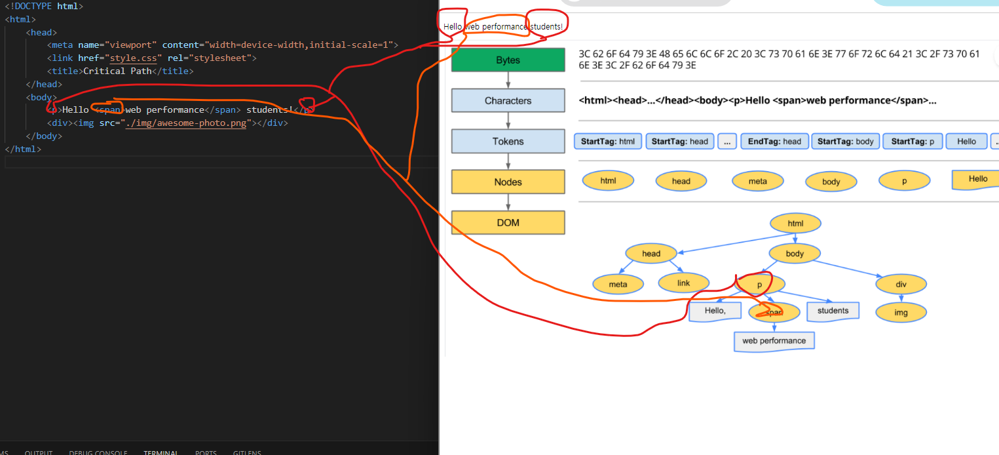
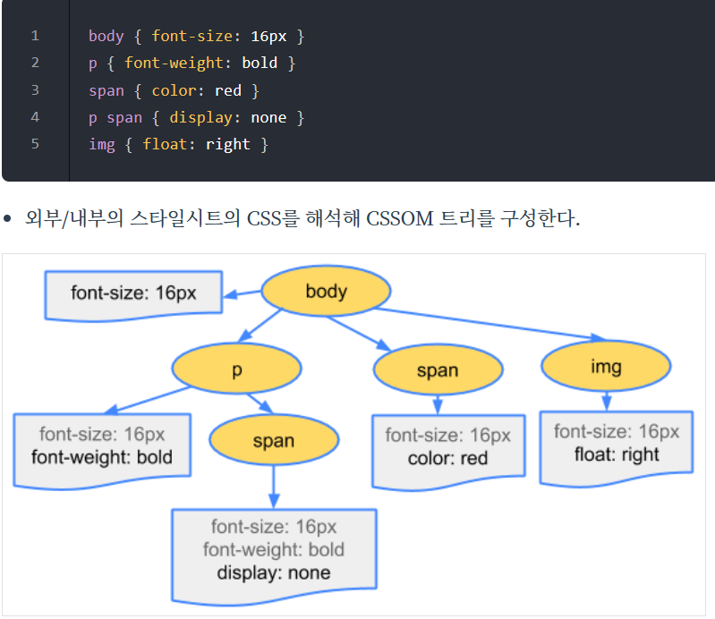
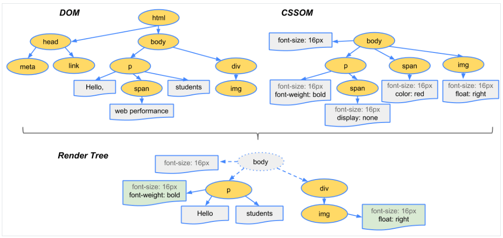
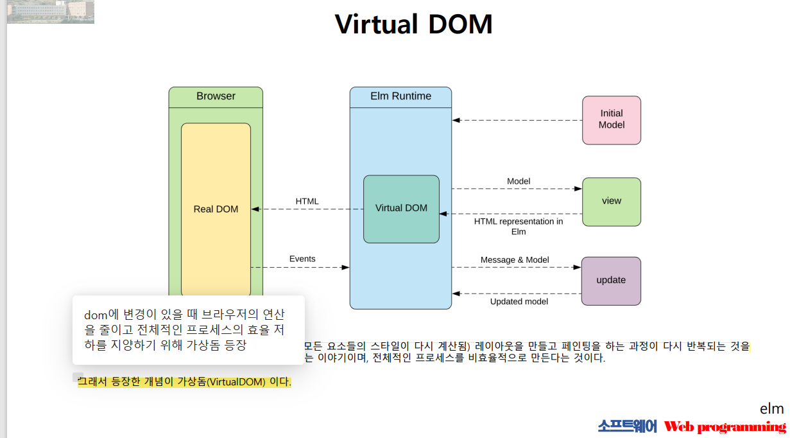
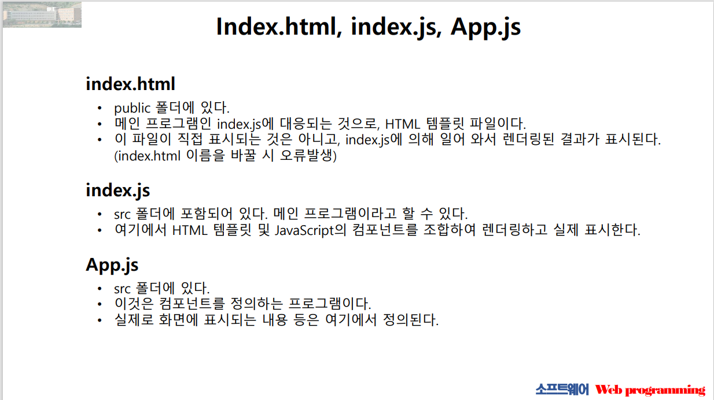
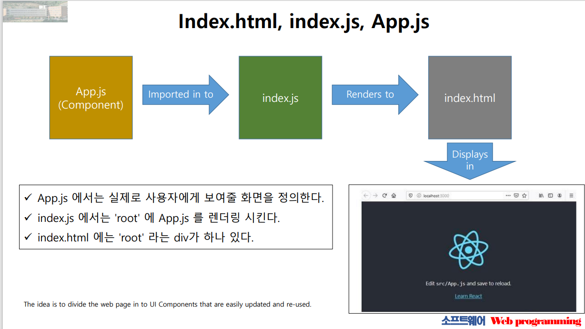
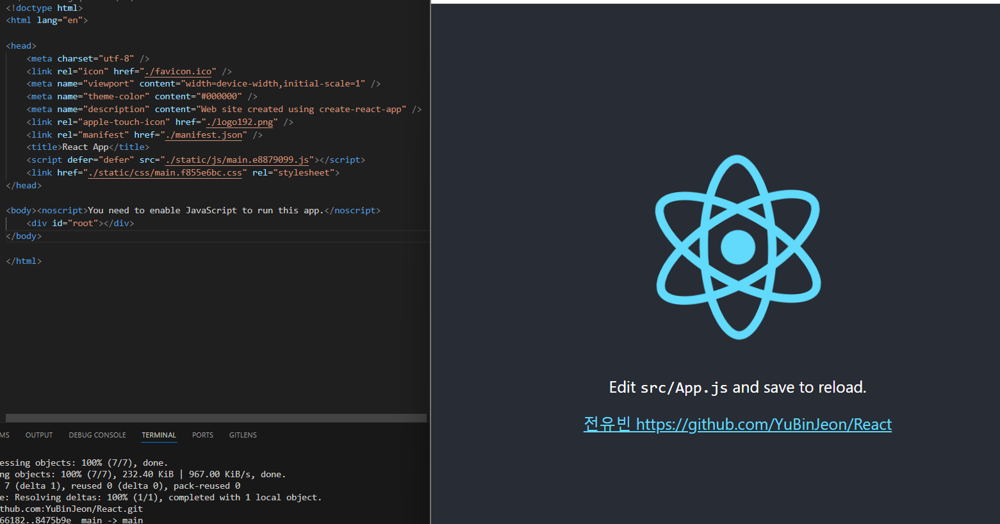

### 0322

### DOM_TREE 파싱을 가시적으로 표현

### CSS_TREE 파싱을 가시적으로 표현

### 위 두 트리를 종합하면 아래와 같은 렌더링 트리를 그릴 수 있다

### 아래는 virtual dom의 등장 배경에 대한 간단한 설명과 구조이다

뷰(HTML)에 변화가 있을 때, 구 가상돔(Old Node)과 새 가상돔(New Node)을 비교하여 변경된 내용만 DOM에 적용한다.
이를 통해 브라우저 내에서 발생하는 연산의 양(정확히는 렌더링 과정)을 줄이면서 성능이 개선되는 구조라고 볼 수 있다.

### 여기까지 배경을 소개했고 이제 REACT를 들어가겠다

상단은 react의 핵심이 되는 파일들과 그에 대한 간단한 설명이고 구조는 아래와 같이 흘러간다

아래는 예제 파일 코드와 실행 결과이다

아래는 이번주 레포트 실행 결과이다

