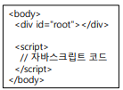
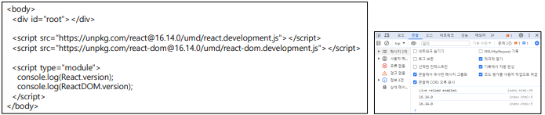
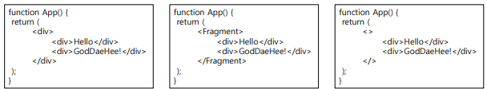
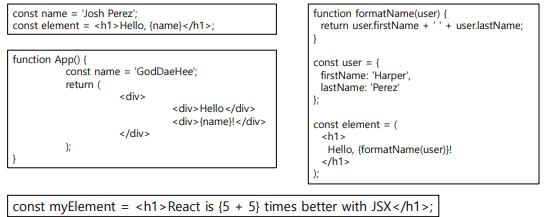
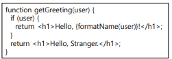
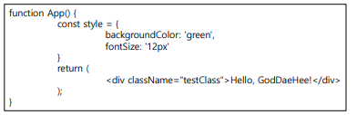
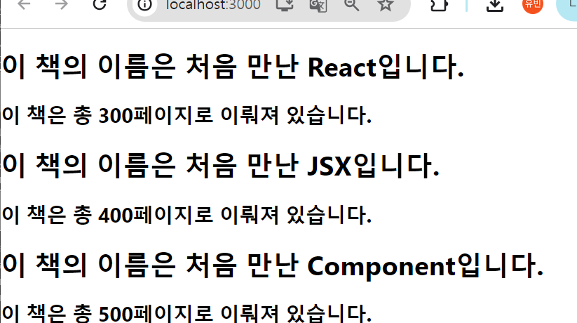
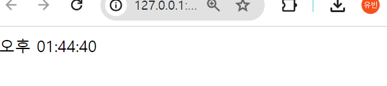
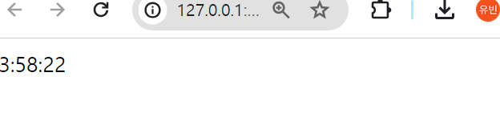
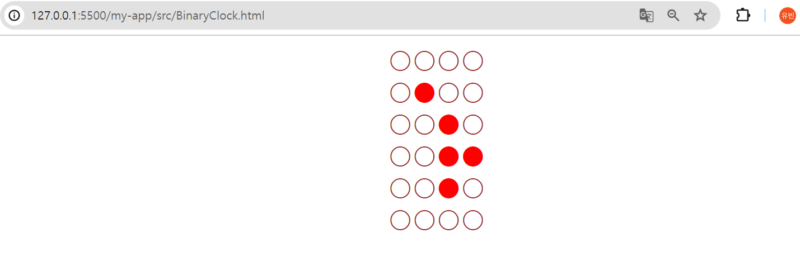

### JSX
JSX(JavaScript XML,JavaScript Syntax eXtension)는 XML과 유사한 JavaScript 언어 구문에 대한 확장입니다. 

- 현재 배우는 React에서도 사용 되는 문법으로 자바스크립트 코드 내에서 HTML 요소를 작성할 수 있게 합니다.
-  컴포넌트 기반의 UI를 작성할 때 사용합니다.
- JSX를 통해 사용자는 좀 더 간결하고 직관적인 코드로 웹에플리케이션 UI를 구성할 수 있습니다.

아래는 JSX의 구동에 대한 가시적인 표현입니다


***
1.JavaScript Library - Frontend:
- 프론트엔드 라이브러리들은 주로 자바스크립트를 사용하여 HTML 엘리먼트를 동적으로 생성하여 DOM에 추가합니다.
- 최신 프론트엔드 라이브러리로 작성된 SPA(Single Page Application)에서는 HTML 코드가 대부분 하나의 <div> 엘리먼트 안에만 존재합니다.



2.React Raw API:
- React API를 사용하여 엘리먼트를 생성하고 DOM에 추가합니다.
React 및 ReactDOM 패키지를 \<script> 태그를 통해 불러올 수 있으며, 이러한 패키지를 통해 React 엘리먼트를 생성하여 렌더링합니다.


3.JSX:
- JSX는 자바스크립트 코드 내에서 HTML 엘리먼트를 작성하는 방법으로, HTML 태그를 React 엘리먼트로 변환해줍니다.
- JSX를 사용하면 더 간결하고 직관적인 코드를 작성할 수 있으며, Babel과 같은 트랜스파일러를 통해 브라우저가 실행할 수 있는 자바스크립트로 변환됩니다.

3-1 JSX의 주요 특징:
- 하나의 최상위 부모 요소로 감싸야 합니다.


- 자바스크립트 표현식을 중괄호 {}로 감싸서 사용할 수 있습니다.


- JSX는 자바스크립트 표현식으로 인식되며, if 문 대신 삼항 연산자나 논리 연산자를 사용하여 조건부 렌더링이 가능합니다.



- JSX 속성을 정의할 때에는 HTML 어트리뷰트 대신 camelCase를 사용해야 합니다.


- 주석은 {/* ... */} 형식을 사용하여 작성하거나, 시작 태그 내에서 //를 사용할 수 있습니다.

***
# 실습
간단한 JSX 코드 작성(도서관)
- src 폴더 내에 JSXCode 폴더에 book, booklibrary 작성 후 index.js 수정


간단한 시계(고정값)
```
<!DOCTYPE html>
<html>
	<head>
		<title>new document</title>
		<meta http-equiv="content-type" content="text/html;charset=utf-8" />
	</head>
	<script type="text/javascript">
		<!-- setInterval("dpTime()", 1000);
		function dpTime() {
					var now = new Date();
					hours = now.getHours();
					minutes = now.getMinutes();
					seconds = now.getSeconds();
					if (hours > 12) {
								hours -= 12;
								ampm = "오후 ";
							} else {
										ampm = "오전 ";
									}
					if (hours < 10) {
								hours = "0" + hours;
							}
					if (minutes < 10) {
								minutes = "0" + minutes;
							}
					if (seconds < 10) {
								seconds = "0" + seconds;
							}
					document.getElementById("dpTime").innerHTML =
						ampm + hours + ":" + minutes + ":" + seconds;
				}
		//-->
	</script>
	<span id="dpTime">오후 01:44:40</span>
	<body>
	</body>
</html>

```



간단한 시계2(함수를 매초 실행해 동적으로 현재 시간 정보 제공)

```
<!DOCTYPE html>
<html>
	<head>
		<meta charset="utf-8">
		<script src="https://unpkg.com/react@15/dist/react.min.js"></script>
		<script src="https://unpkg.com/react-dom@15/dist/react-dom.min.js"></script> 
		<script src="https://cdnjs.cloudflare.com/ajax/libs/babel-core/5.8.38/browser.min.js"></script>
	</head>
	<body>
		<div id="root"></div>
		<script type="text/babel"> // 정기적으로 시간을 출력합니다.
			setInterval(showClock, 1000) // 매 초마다 실행되는 함수입니다.
function showClock () {
const d = new Date()
const hour = d.getHours()
const min = d.getMinutes()
const sec = d.getSeconds() 
const elem = <div> {hour}:{min}:{sec}
</div> 
const root = document.getElementById("root")
ReactDOM.render(elem, root)
} 
		</script>
	</body>
</html>

```


BinaryClock(동적으로 시간 정보 제공)

```
<!DOCTYPE html>
<html>

<head>
	<meta charset="utf-8">
	<script src="https://unpkg.com/react@15/dist/react.min.js"></script>
	<script src="https://unpkg.com/react-dom@15/dist/react-dom.min.js"></script>
	<script src="https://cdnjs.cloudflare.com/ajax/libs/babel-core/5.8.38/browser.min.js"></script>
	<style>
		body {
			font-size: 32px;
			text-align: center;
		}
	</style>
</head>

<body>
	<div><div id="disp"></div></div>
	<script type="text/babel">
		// 정기적으로 화면을 변경하게 지정합니다.
		setInterval(update, 1000)
		// 정기적으로 실행되는 함수입니다.
		function update() {
			// 현재 시간을 이진 숫자로 변환합니다. ---- (※1)
			const now = new Date();
			const hh = z2(now.getHours())
			const mm = z2(now.getMinutes())
			const ss = z2(now.getSeconds())
			const binStr = hh + mm + ss 
			const style0 = { color: 'brown' }
			const style1 = { color: 'red' }
			const lines = []
			for (let i = 0; i < binStr.length; i++) {
				const v = parseInt(binStr.substr(i, 1))
				const bin = "0000" + v.toString(2)
				const bin8 = bin.substr(bin.length - 4, 4)
				// 이진 숫자를 구성하는 리액트 객체를 lines 배열에 추가합니다. --- (※2)
				for (let j = 0; j < bin8.length; j++) {
					if (bin8.substr(j, 1) === '0') {
						lines.push(<span style={style0}>○</span>)
					} else {
						lines.push(<span style={style1}>●</span>)
					}
				}
				lines.push(<br />)
			}
			// DOM의 내용을 변경합니다. --- (※3)
			const disp = document.getElementById('disp')
			ReactDOM.render(<div>{lines}</div>, disp)
		}
		function z2(v) {
			v = String("00" + v)
			return v.substr(v.length - 2, 2)
		} 
	</script>
</body>
</html>
```

